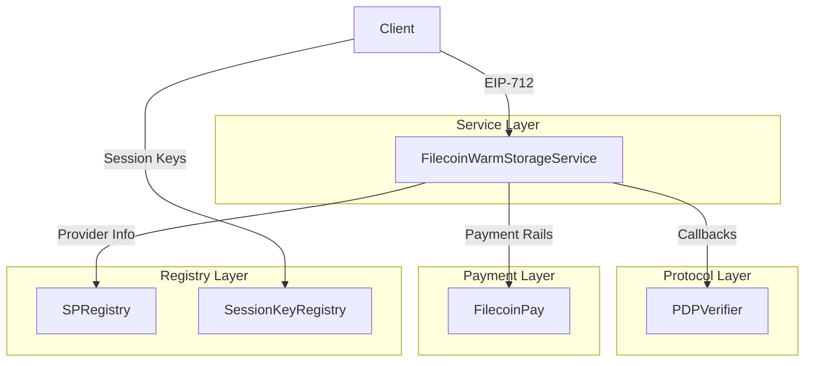
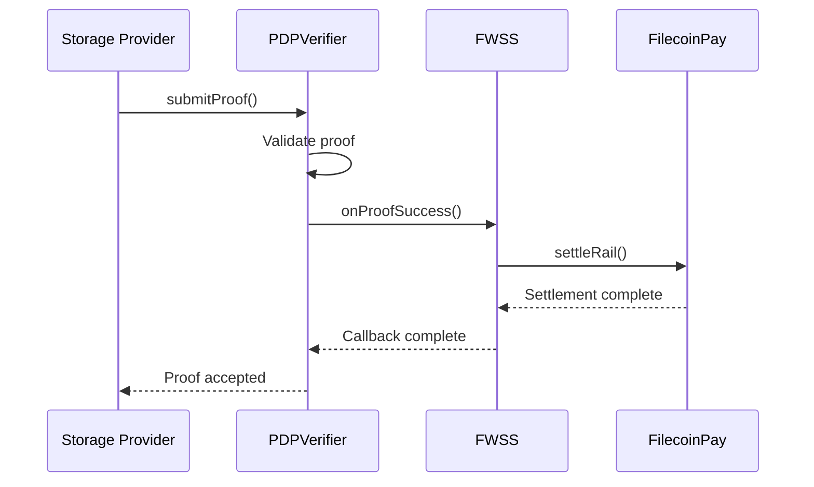
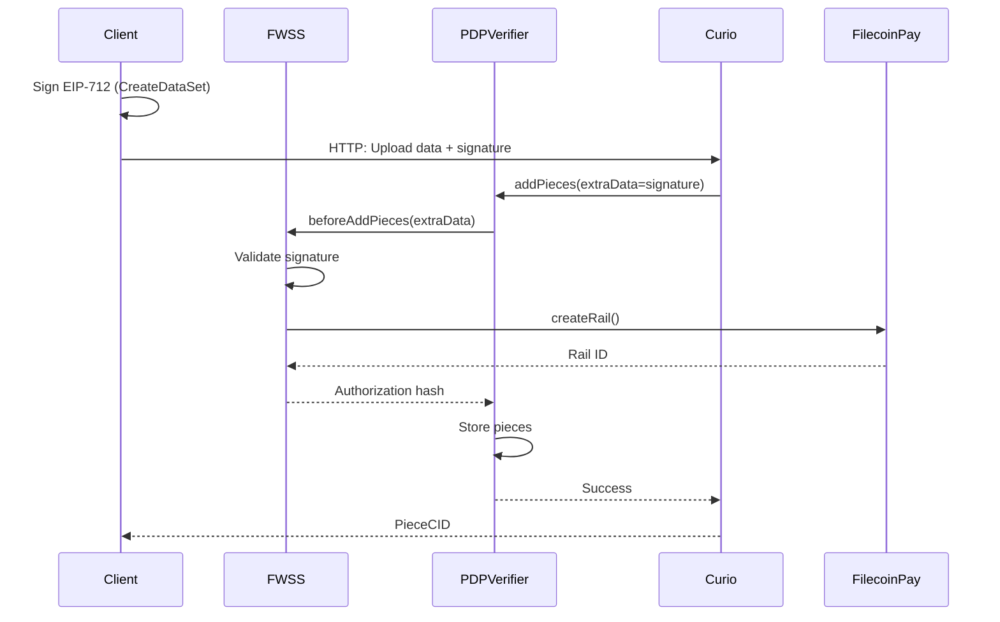
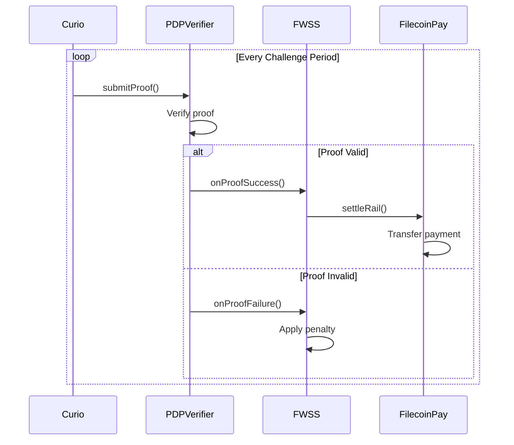

## Layered Architecture

The smart contract system is organized in three layers:



## Separation of Concerns

### Protocol Layer (PDPVerifier)

**Responsibility:** Neutral proof verification

- No business logic
- No payment handling
- Only validates cryptographic proofs
- Delegates to service contracts via callbacks

```solidity
interface IPDPVerifier {
    function addPieces(
        uint256 dataSetId,
        PieceInfo[] calldata pieces,
        bytes calldata extraData
    ) external;
    
    function submitProof(
        uint256 dataSetId,
        bytes calldata proof
    ) external;
}
```

### Service Layer (FWSS)

**Responsibility:** Business logic and payment management

- Client authorization (EIP-712)
- Provider whitelist management
- Payment rail creation and management
- Data set lifecycle
- Implements PDPListener callbacks

```solidity
interface IFilecoinWarmStorageService {
    function beforeAddPieces(
        uint256 dataSetId,
        PieceInfo[] calldata pieces,
        bytes calldata extraData
    ) external returns (bytes32);
    
    function onProofSuccess(
        uint256 dataSetId
    ) external;
    
    function onProofFailure(
        uint256 dataSetId
    ) external;
}
```

### Payment Layer (FilecoinPay)

**Responsibility:** Generic payment rails

- Deposits and withdrawals
- Payment rail creation
- Rate-based continuous payments
- Operator approvals (for services)
- Settlement with validation callbacks

```solidity
interface IFilecoinPay {
    function deposit(uint256 amount, address to) external;
    function withdraw(uint256 amount) external;
    function setOperatorApproval(
        address operator,
        bool approve,
        uint256 rateAllowance,
        uint256 lockupAllowance,
        uint256 maxLockupPeriod
    ) external;
}
```

## Callback Pattern

FWSS implements PDPListener callbacks to hook into proof events:



## Contract Interaction Flow

### Upload Flow



### Proof Flow



## State Management

### FWSS State

```solidity
struct DataSet {
    uint256 id;
    address client;
    address payer;
    uint256 providerId;
    uint256 railId;
    uint256 startEpoch;
    uint256 terminatedAtEpoch;
    Metadata[] metadata;
}

struct Piece {
    uint256 id;
    uint256 dataSetId;
    bytes32 pieceCid;
    uint256 size;
    Metadata[] metadata;
}

mapping(uint256 => DataSet) public dataSets;
mapping(uint256 => Piece) public pieces;
mapping(address => uint256[]) public clientDataSets;
```

### Payment State

```solidity
struct Rail {
    uint256 id;
    address client;
    address payee;
    address operator;
    uint256 rate;
    uint256 startEpoch;
    uint256 lastSettledEpoch;
    uint256 endEpoch;
}

struct OperatorApproval {
    bool isApproved;
    uint256 rateAllowance;
    uint256 lockupAllowance;
    uint256 maxLockupPeriod;
    uint256 rateUsage;
    uint256 lockupUsage;
}

mapping(uint256 => Rail) public rails;
mapping(address => mapping(address => OperatorApproval)) public operatorApprovals;
```

## Provider Management

### Endorsed vs Approved

```solidity
// Endorsed: curated, high-quality providers (subset of approved)
mapping(uint256 => bool) public endorsedProviders;

// Approved: pass automated quality checks
mapping(uint256 => bool) public approvedProviders;

function addApprovedProvider(uint256 providerId) external onlyOwner {
    approvedProviders[providerId] = true;
}

function endorseProvider(uint256 providerId) external onlyOwner {
    require(approvedProviders[providerId], "Must be approved first");
    endorsedProviders[providerId] = true;
}
```

## EIP-712 Domain Separation

Each operation has a unique EIP-712 type:

```typescript
// CreateDataSet
const types = {
  DataSetInfo: [
    { name: 'client', type: 'address' },
    { name: 'payer', type: 'address' },
    { name: 'serviceProvider', type: 'address' },
    { name: 'serviceProviderId', type: 'uint256' },
    { name: 'startEpoch', type: 'uint256' },
    { name: 'rate', type: 'uint256' },
    { name: 'lockup', type: 'uint256' },
    { name: 'metadata', type: 'MetadataEntry[]' },
  ],
}

// AddPieces
const types = {
  AddPiecesInfo: [
    { name: 'dataSetId', type: 'uint256' },
    { name: 'pieces', type: 'PieceInput[]' },
  ],
}
```

## Nonce Management

Nonces prevent replay attacks:

```solidity
mapping(address => uint256) public nonces;

function incrementNonce(address account) internal {
    nonces[account]++;
}

function validateSignature(
    address signer,
    bytes32 hash,
    bytes calldata signature
) internal view {
    require(nonces[signer] == expectedNonce, "Invalid nonce");
    // ... validate signature
}
```

## Metadata System

```solidity
struct MetadataEntry {
    string key;
    string value;
}

// Validation
uint256 constant MAX_DATASET_METADATA_ENTRIES = 10;
uint256 constant MAX_PIECE_METADATA_ENTRIES = 5;
uint256 constant MAX_KEY_LENGTH = 32;
uint256 constant MAX_VALUE_LENGTH = 128;

function validateMetadata(
    MetadataEntry[] calldata metadata,
    uint256 maxEntries
) internal pure {
    require(metadata.length <= maxEntries, "Too many entries");
    
    for (uint256 i = 0; i < metadata.length; i++) {
        require(
            bytes(metadata[i].key).length <= MAX_KEY_LENGTH,
            "Key too long"
        );
        require(
            bytes(metadata[i].value).length <= MAX_VALUE_LENGTH,
            "Value too long"
        );
    }
}
```

## Access Control

```solidity
// Owner functions (FWSS)
function addApprovedProvider(uint256 providerId) external onlyOwner;
function setServicePrice(...) external onlyOwner;

// Client functions (require ownership or authorization)
function terminateDataSet(uint256 dataSetId) external {
    DataSet storage ds = dataSets[dataSetId];
    require(
        ds.payer == msg.sender || 
        isAuthorizedOperator(ds.payer, msg.sender),
        "Not authorized"
    );
    // ...
}

// Session key authorization
function isAuthorizedOperator(
    address account,
    address operator
) public view returns (bool) {
    return sessionKeyRegistry.hasPermission(
        account,
        operator,
        TERMINATE_DATASET_PERMISSION
    );
}
```

## Contract Upgradability

<Warning>
  Contracts are NOT upgradeable by design for security and immutability.
  New features require new contract deployments.
</Warning>

## Gas Optimization

- Packed storage slots
- Minimal storage writes
- Multicall support
- Batch operations (e.g., `addPieces` accepts arrays)

## Best Practices

<CardGroup cols={2}>
  <Card title="EIP-712 Signing" icon="signature">
    Always use EIP-712 for off-chain authorization
  </Card>
  <Card title="Nonce Management" icon="hashtag">
    Track nonces to prevent replay attacks
  </Card>
  <Card title="Callback Pattern" icon="arrow-turn-down-right">
    Use callbacks for cross-contract communication
  </Card>
  <Card title="Minimal Storage" icon="database">
    Optimize storage for gas efficiency
  </Card>
</CardGroup>

## Next Steps

<CardGroup cols={2}>
  <Card title="FWSS Contract" href="/contracts/warm-storage" icon="hard-drive">
    Learn about the storage service contract
  </Card>
  <Card title="Filecoin Pay" href="/contracts/filecoin-pay" icon="money-bill-wave">
    Understand payment rails
  </Card>
  <Card title="PDP Verifier" href="/contracts/pdp-verifier" icon="shield-check">
    Explore proof verification
  </Card>
</CardGroup>