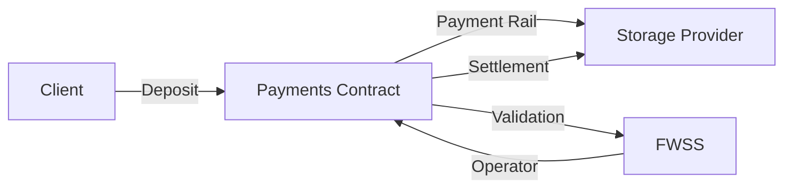

## Overview

Filecoin Pay V1 enables ERC20 token payment flows through **payment rails** - automated payment channels between payers and recipients. It supports:

- Continuous rate-based payments (per epoch)
- Deposits and withdrawals
- Operator approvals (delegate rail creation)
- Settlement with validation callbacks
- One-time transfers

## Payment Rails

A payment rail is a persistent payment channel:

```solidity
struct Rail {
    uint256 id;
    address client;        // Payer
    address payee;         // Recipient
    address operator;      // Service contract (optional)
    uint256 rate;          // Amount per epoch
    uint256 startEpoch;
    uint256 lastSettledEpoch;
    uint256 endEpoch;      // 0 = active, >0 = terminated
}
```

## Architecture



## Account Management

### Deposit

```typescript
import * as Pay from '@filoz/synapse-core/pay'
import { createWalletClient, http } from 'viem'
import { calibration } from '@filoz/synapse-core/chains'

const client = createWalletClient({
  chain: calibration,
  transport: http(),
  account,
})

const hash = await Pay.deposit(client, {
  amount: 100000000000000000000n, // 100 tokens (18 decimals)
  to: account.address, // Optional, defaults to sender
})

await client.waitForTransactionReceipt({ hash })
```

### Deposit with Permit (ERC-2612)

```typescript
const hash = await Pay.depositWithPermit(client, {
  amount: 100000000000000000000n,
  deadline: BigInt(Math.floor(Date.now() / 1000) + 3600), // 1 hour
})
```

### Deposit and Approve Operator

Combine deposit + operator approval in one transaction:

```typescript
const hash = await Pay.depositAndApprove(client, {
  amount: 100000000000000000000n,
  operator: calibration.contracts.fwss.address,
  rateAllowance: 10000000000000000000n,    // 10 tokens per epoch
  lockupAllowance: 1000000000000000000000n, // 1000 tokens lockup
})
```

### Withdraw

```typescript
const hash = await Pay.withdraw(client, {
  amount: 50000000000000000000n, // 50 tokens
})
```

### Check Balance

```typescript
const account = await Pay.accounts(client, {
  address: account.address,
})

console.log('Available:', account.availableFunds)
console.log('Total deposited:', account.totalDeposited)
console.log('Total withdrawn:', account.totalWithdrawn)
console.log('Total paid:', account.totalPaid)
console.log('Total received:', account.totalReceived)
```

## Operator Approvals

Operators (like FWSS) can create rails on behalf of clients:

### Approve Operator

```typescript
const hash = await Pay.setOperatorApproval(client, {
  operator: calibration.contracts.fwss.address,
  approve: true,
  rateAllowance: 10000000000000000000n,    // Max 10 tokens/epoch
  lockupAllowance: 1000000000000000000000n, // Max 1000 tokens lockup
  maxLockupPeriod: 2880n,                    // Max 30 days (in epochs)
})
```

### Revoke Operator

```typescript
const hash = await Pay.setOperatorApproval(client, {
  operator: calibration.contracts.fwss.address,
  approve: false,
})
```

### Check Approval Status

```typescript
const approval = await Pay.operatorApprovals(client, {
  address: account.address,
  operator: calibration.contracts.fwss.address,
})

console.log('Approved:', approval.isApproved)
console.log('Rate allowance:', approval.rateAllowance)
console.log('Lockup allowance:', approval.lockupAllowance)
console.log('Max lockup period:', approval.maxLockupPeriod)
console.log('Rate used:', approval.rateUsage)
console.log('Lockup used:', approval.lockupUsage)
```

## Rail Management

### Get Rail Info

```typescript
const rail = await Pay.getRail(client, { 
  railId: 42n 
})

console.log('Client:', rail.client)
console.log('Payee:', rail.payee)
console.log('Operator:', rail.operator)
console.log('Rate per epoch:', rail.rate)
console.log('Start:', rail.startEpoch)
console.log('Last settled:', rail.lastSettledEpoch)
console.log('End:', rail.endEpoch) // 0 = active
```

### Query Rails

```typescript
// Get all rails where address is payer
const { results: payerRails } = await Pay.getRailsForPayerAndToken(client, {
  payer: account.address,
})

// Get all rails where address is payee
const { results: payeeRails } = await Pay.getRailsForPayeeAndToken(client, {
  payee: account.address,
})

for (const rail of payerRails) {
  console.log(`Rail ${rail.railId}:`)
  console.log(`  To: ${rail.payee}`)
  console.log(`  Rate: ${rail.rate}/epoch`)
  console.log(`  Active: ${rail.active}`)
}
```

## Settlement

### Settle Rail

```typescript
const hash = await Pay.settleRail(client, {
  railId: 42n,
  untilEpoch: 1000n, // Optional, defaults to current epoch
})
```

### Get Settlement Amounts (Read-Only)

```typescript
import { simulateContract } from 'viem/actions'

const { result } = await simulateContract(
  client,
  Pay.settleRailCall({
    chain: calibration,
    railId: 42n,
    untilEpoch: 1000n,
  })
)

const [
  totalSettledAmount,
  totalNetPayeeAmount,
  totalOperatorCommission,
  totalNetworkFee,
  finalSettledEpoch,
  note,
] = result

console.log('Total settled:', totalSettledAmount)
console.log('Net payee:', totalNetPayeeAmount)
console.log('Operator fee:', totalOperatorCommission)
console.log('Network fee:', totalNetworkFee)
```

### Emergency Settlement (Terminated Rails)

```typescript
const hash = await Pay.settleTerminatedRailWithoutValidation(client, {
  railId: 42n,
})
```

<Note>
  Emergency settlement bypasses validator callbacks. Use only for terminated rails
  after max settlement epoch has passed.
</Note>

## Validation Callbacks

Service contracts can validate settlements:

```solidity
interface ISettlementValidator {
    function beforeSettle(
        uint256 railId,
        uint256 untilEpoch,
        uint256 amount
    ) external returns (bool approved, uint256 approvedAmount, string memory note);
}
```

FWSS implements this to verify storage proofs before settlement.

## Events

### Deposit

```solidity
event Deposited(
    address indexed account,
    uint256 amount
);
```

### RailCreated

```solidity
event RailCreated(
    uint256 indexed railId,
    address indexed client,
    address indexed payee,
    uint256 rate
);
```

### RailSettled

```solidity
event RailSettled(
    uint256 indexed railId,
    uint256 amount,
    uint256 settledEpoch
);
```

### Listen for Events

```typescript
import { watchContractEvent } from 'viem/actions'

const unwatch = watchContractEvent(client, {
  address: calibration.contracts.filecoinPay.address,
  abi: calibration.contracts.filecoinPay.abi,
  eventName: 'RailSettled',
  args: {
    railId: 42n,
  },
  onLogs: (logs) => {
    for (const log of logs) {
      console.log('Rail settled:')
      console.log('  Amount:', log.args.amount)
      console.log('  Epoch:', log.args.settledEpoch)
    }
  },
})
```

## Fee Structure

```typescript
// Settlement includes fees
totalSettledAmount = baseAmount + operatorCommission + networkFee
totalNetPayeeAmount = baseAmount

// Fees are configurable by contract owner
// Example:
// Operator commission: 5%
// Network fee: 1%
```

## Best Practices

<CardGroup cols={2}>
  <Card title="Use Operator Approvals" icon="shield-check">
    Let services manage rails with operator approvals
  </Card>
  <Card title="Monitor Balance" icon="gauge-high">
    Keep sufficient balance for continuous payments
  </Card>
  <Card title="Settle Regularly" icon="calendar-check">
    Settle rails to free up locked funds
  </Card>
  <Card title="Use Permits" icon="stamp">
    Use permit functions to reduce transaction count
  </Card>
</CardGroup>

## Specification

<Card title="Filecoin Pay README" href="https://github.com/FilOzone/filecoin-pay/blob/main/README.md" icon="file-lines">
  Read the full payment rails specification
</Card>

## Source Code

<Card title="Filecoin Pay" href="https://github.com/FilOzone/filecoin-pay" icon="github">
  View the FilecoinPay contract source
</Card>

## Next Steps

<CardGroup cols={2}>
  <Card title="FWSS Contract" href="/contracts/warm-storage" icon="hard-drive">
    Learn how FWSS uses payment rails
  </Card>
  <Card title="Payment Management" href="/guides/payment-management" icon="credit-card">
    Use payments in your app
  </Card>
</CardGroup>