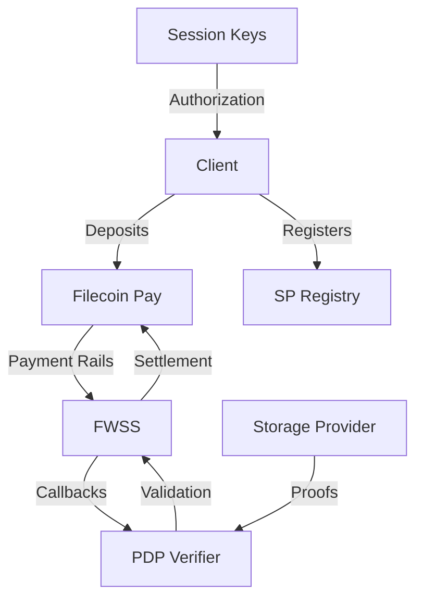

## Architecture

Filecoin Onchain Cloud consists of several interrelated smart contracts:



## Contract Responsibilities

<CardGroup cols={2}>
  <Card title="Filecoin Pay" href="/contracts/filecoin-pay" icon="money-bill-wave">
    Generic payment rails for continuous rate-based payments
  </Card>
  <Card title="Warm Storage" href="/contracts/warm-storage" icon="hard-drive">
    Storage service with PDP verification and payment integration
  </Card>
  <Card title="PDP Verifier" href="/contracts/pdp-verifier" icon="shield-check">
    Neutral proof verification without business logic
  </Card>
  <Card title="SP Registry" href="/contracts/sp-registry" icon="list">
    Provider registration and discovery
  </Card>
  <Card title="Session Keys" href="/contracts/session-key-registry" icon="key">
    Disposable key authorization for dapps
  </Card>
</CardGroup>

## Data Flow

### Upload Flow

<Steps>

### Client Signs EIP-712

Client creates an EIP-712 signed message for the FWSS contract:

```typescript
import { signCreateDataSet } from '@filoz/synapse-core/typed-data'

const signature = await signCreateDataSet(client, {
  dataSetInfo: {
    client: client.account.address,
    payer: client.account.address,
    serviceProvider: provider.serviceProvider,
    serviceProviderId: provider.id,
    startEpoch: currentEpoch,
    rate: estimatedRate,
    lockup: estimatedLockup,
    metadata: [],
  },
  nonce: currentNonce,
})
```

### Curio HTTP API

Storage provider's Curio instance receives the signed message and data.

### PDP Verifier Contract

Curio calls PDPVerifier with the signature in `extraData`:

```solidity
function addPieces(
    uint256 dataSetId,
    PieceInfo[] calldata pieces,
    bytes calldata extraData
) external;
```

### FWSS Callback

PDPVerifier delegates to FWSS via callback:

```solidity
function beforeAddPieces(
    uint256 dataSetId,
    PieceInfo[] calldata pieces,
    bytes calldata extraData
) external returns (bytes32);
```

### Payment Rails

FWSS validates signature and creates/updates payment rail in Filecoin Pay.

</Steps>

### Proof Flow

<Steps>

### Periodic Proofs

Storage provider submits PDP proofs periodically to PDPVerifier.

### Validation

PDPVerifier validates the cryptographic proofs.

### Settlement

On successful proof, payment rail settles funds from client to provider.

### Failure Handling

Failed proofs result in penalty or data set termination.

</Steps>

## Contract Addresses

### Mainnet

Contract addresses are auto-discovered from the network. Query via:

```typescript
import { mainnet } from '@filoz/synapse-core/chains'

console.log('FWSS:', mainnet.contracts.fwss.address)
console.log('Payments:', mainnet.contracts.filecoinPay.address)
console.log('PDP Verifier:', mainnet.contracts.pdpVerifier.address)
console.log('SP Registry:', mainnet.contracts.spRegistry.address)
```

### Calibration Testnet

```typescript
import { calibration } from '@filoz/synapse-core/chains'

console.log('FWSS:', calibration.contracts.fwss.address)
console.log('Payments:', calibration.contracts.filecoinPay.address)
```

## EIP-712 Signing

All contract interactions use EIP-712 typed data for security:

```typescript
import * as TypedData from '@filoz/synapse-core/typed-data'

// Create data set
const createSig = await TypedData.signCreateDataSet(client, { dataSetInfo, nonce })

// Add pieces
const addSig = await TypedData.signAddPieces(client, { addPiecesInfo, nonce })

// Delete data set
const deleteSig = await TypedData.signDeleteDataSet(client, { deleteInfo, nonce })
```

## Contract ABIs

All ABIs are available in `@filoz/synapse-core`:

```typescript
import { calibration } from '@filoz/synapse-core/chains'

const fwssAbi = calibration.contracts.fwss.abi
const payAbi = calibration.contracts.filecoinPay.abi
const pdpAbi = calibration.contracts.pdpVerifier.abi
```

## Read vs Write Operations

### Read Operations

Query contract state without transactions:

```typescript
import * as WarmStorage from '@filoz/synapse-core/warm-storage'
import { createPublicClient, http } from 'viem'

const client = createPublicClient({
  chain: calibration,
  transport: http(),
})

// Get service price
const price = await WarmStorage.getServicePrice(client)

// Get approved providers
const providers = await WarmStorage.getApprovedProviders(client)

// Get data set info
const dataSet = await WarmStorage.getDataSet(client, { dataSetId: 123n })
```

### Write Operations

Send transactions to modify state:

```typescript
import * as WarmStorage from '@filoz/synapse-core/warm-storage'
import { createWalletClient, http } from 'viem'

const client = createWalletClient({
  chain: calibration,
  transport: http(),
  account,
})

// Terminate data set
const hash = await WarmStorage.terminateDataSet(client, { dataSetId: 123n })

// Wait for confirmation
const receipt = await client.waitForTransactionReceipt({ hash })
```

## Event Listening

```typescript
import { watchContractEvent } from 'viem/actions'

const unwatch = watchContractEvent(client, {
  address: chain.contracts.fwss.address,
  abi: chain.contracts.fwss.abi,
  eventName: 'DataSetCreated',
  onLogs: (logs) => {
    for (const log of logs) {
      console.log('Data set created:', log.args.dataSetId)
    }
  },
})

// Stop watching
unwatch()
```

## Multicall

Batch multiple read operations:

```typescript
import { multicall } from 'viem/actions'
import * as WarmStorage from '@filoz/synapse-core/warm-storage'
import * as Pay from '@filoz/synapse-core/pay'

const results = await multicall(client, {
  contracts: [
    WarmStorage.getServicePriceCall({ chain: calibration }),
    WarmStorage.getApprovedProvidersCall({ chain: calibration }),
    Pay.accountsCall({ chain: calibration, address: account.address }),
  ],
})

const [priceResult, providersResult, accountResult] = results
```

## Gas Estimation

```typescript
import { estimateContractGas } from 'viem/actions'
import * as WarmStorage from '@filoz/synapse-core/warm-storage'

const gas = await estimateContractGas(
  client,
  WarmStorage.terminateDataSetCall({
    chain: calibration,
    dataSetId: 123n,
  })
)

console.log(`Estimated gas: ${gas}`)
```

## Contract Simulation

```typescript
import { simulateContract } from 'viem/actions'

const { result, request } = await simulateContract(
  client,
  WarmStorage.terminateDataSetCall({
    chain: calibration,
    dataSetId: 123n,
  })
)

console.log('Simulation result:', result)

// If simulation succeeds, execute
const hash = await writeContract(client, request)
```

## Error Handling

```typescript
import { BaseError, ContractFunctionRevertedError } from 'viem'

try {
  await WarmStorage.terminateDataSet(client, { dataSetId: 123n })
} catch (error) {
  if (error instanceof BaseError) {
    const revertError = error.walk(
      err => err instanceof ContractFunctionRevertedError
    )
    
    if (revertError instanceof ContractFunctionRevertedError) {
      const errorName = revertError.data?.errorName
      console.error('Contract revert:', errorName)
      
      // Handle specific errors
      if (errorName === 'NotAuthorized') {
        console.error('You do not own this data set')
      }
    }
  }
}
```

## Network Configuration

```typescript
import { mainnet, calibration } from '@filoz/synapse-core/chains'

// Mainnet (production)
console.log('Chain ID:', mainnet.id)
console.log('RPC:', mainnet.rpcUrls.default.http[0])
console.log('Explorer:', mainnet.blockExplorers?.default.url)

// Calibration (testnet)
console.log('Chain ID:', calibration.id)
console.log('RPC:', calibration.rpcUrls.default.http[0])
console.log('Testnet:', calibration.testnet)
```

## Best Practices

<CardGroup cols={2}>
  <Card title="Use SDK" icon="box">
    Use Synapse SDK for high-level operations
  </Card>
  <Card title="Multicall Reads" icon="layer-group">
    Batch multiple reads with multicall
  </Card>
  <Card title="Simulate First" icon="flask">
    Always simulate before executing writes
  </Card>
  <Card title="Handle Reverts" icon="triangle-exclamation">
    Parse and handle contract-specific errors
  </Card>
</CardGroup>

## Source Code

<CardGroup cols={2}>
  <Card title="FWSS" href="https://github.com/FilOzone/filecoin-services" icon="github">
    Filecoin Warm Storage Service contracts
  </Card>
  <Card title="Filecoin Pay" href="https://github.com/FilOzone/filecoin-pay" icon="github">
    Payment rails contract
  </Card>
  <Card title="PDP Verifier" href="https://github.com/FilOzone/pdp" icon="github">
    Proof verification contract
  </Card>
  <Card title="SP Registry" href="https://github.com/FilOzone/filecoin-services" icon="github">
    Service provider registry
  </Card>
</CardGroup>

## Next Steps

<CardGroup cols={2}>
  <Card title="FWSS Contract" href="/contracts/warm-storage" icon="hard-drive">
    Learn about the storage service contract
  </Card>
  <Card title="Filecoin Pay" href="/contracts/filecoin-pay" icon="money-bill-wave">
    Understand payment rails
  </Card>
  <Card title="PDP Verifier" href="/contracts/pdp-verifier" icon="shield-check">
    Explore proof verification
  </Card>
</CardGroup>