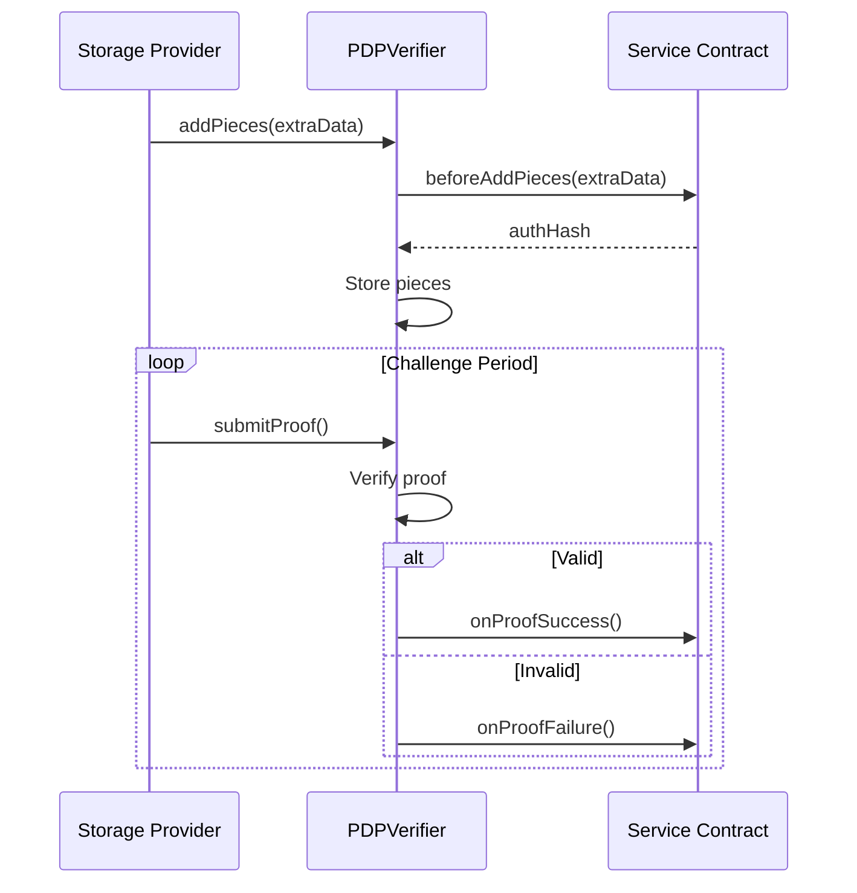
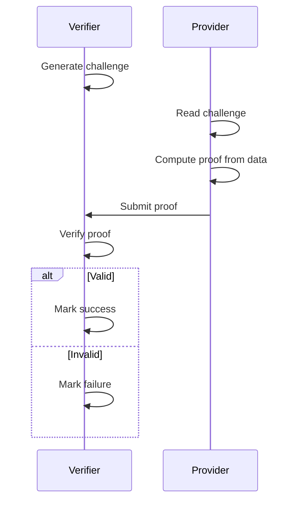

## Overview

The PDPVerifier contract provides neutral cryptographic proof verification for data storage. It:

- Validates storage proofs from providers
- Has NO business logic or payment handling
- Delegates to service contracts via callbacks
- Ensures proof integrity and timing

## Design Philosophy

**Separation of Concerns:**
- PDPVerifier = Protocol layer (proof verification)
- FWSS = Service layer (business logic, payments)

This allows multiple storage services to use the same verifier.

## Architecture



## Data Structures

### PieceInfo

```solidity
struct PieceInfo {
    bytes32 pieceCid;
    uint256 size;
}
```

### ProofData

```solidity
struct ProofData {
    uint256 dataSetId;
    bytes32 challenge;
    bytes32 response;
    uint256 timestamp;
}
```

## Key Functions

### addPieces

Called by storage provider (Curio) to register pieces:

```solidity
function addPieces(
    uint256 dataSetId,
    PieceInfo[] calldata pieces,
    bytes calldata extraData
) external;
```

**Flow:**
1. Calls `beforeAddPieces()` on service contract
2. Service validates `extraData` (EIP-712 signature)
3. Service returns authorization hash
4. Verifier stores pieces

### submitProof

Storage provider submits periodic proofs:

```solidity
function submitProof(
    uint256 dataSetId,
    bytes calldata proof
) external;
```

**Flow:**
1. Validates proof cryptographically
2. Calls `onProofSuccess()` or `onProofFailure()` on service
3. Service handles payment settlement/penalties

### Challenge Generation

Verifier generates random challenges:

```solidity
function generateChallenge(
    uint256 dataSetId
) external view returns (bytes32);
```

## PDPListener Interface

Service contracts implement this interface:

```solidity
interface IPDPListener {
    function beforeAddPieces(
        uint256 dataSetId,
        PieceInfo[] calldata pieces,
        bytes calldata extraData
    ) external returns (bytes32 authHash);
    
    function onProofSuccess(
        uint256 dataSetId
    ) external;
    
    function onProofFailure(
        uint256 dataSetId
    ) external;
}
```

## Read Operations

### Get Data Set Info

```typescript
import * as PDPVerifier from '@filoz/synapse-core/pdp-verifier'
import { createPublicClient, http } from 'viem'
import { calibration } from '@filoz/synapse-core/chains'

const client = createPublicClient({
  chain: calibration,
  transport: http(),
})

const dataSet = await PDPVerifier.getDataSet(client, { 
  dataSetId: 123n 
})

if (dataSet) {
  console.log('Service:', dataSet.service)
  console.log('Provider:', dataSet.provider)
  console.log('Piece count:', dataSet.pieceCount)
}
```

### Get Piece Info

```typescript
const piece = await PDPVerifier.getPiece(client, { 
  pieceId: 456n 
})

console.log('PieceCID:', piece.pieceCid)
console.log('Size:', piece.size)
console.log('Data Set:', piece.dataSetId)
```

### Get Challenge

```typescript
const challenge = await PDPVerifier.getChallenge(client, { 
  dataSetId: 123n 
})

console.log('Current challenge:', challenge)
```

## Proof Verification

### Proof Algorithm

PDP uses a challenge-response protocol:

1. **Challenge:** Verifier generates random challenge
2. **Response:** Provider computes proof using stored data
3. **Verification:** Verifier validates proof cryptographically



### Challenge Period

Proofs are required at regular intervals:

```typescript
import { TIME_CONSTANTS } from '@filoz/synapse-sdk'

// Filecoin epoch = 30 seconds
console.log('Epoch duration:', TIME_CONSTANTS.EPOCH_DURATION)

// Challenge frequency (varies by configuration)
const challengePeriodEpochs = 2880 // Example: daily
const challengePeriodSeconds = challengePeriodEpochs * TIME_CONSTANTS.EPOCH_DURATION

console.log(`Challenge every ${challengePeriodSeconds / 3600} hours`)
```

## Events

### PiecesAdded

```solidity
event PiecesAdded(
    uint256 indexed dataSetId,
    uint256[] pieceIds
);
```

### ProofSubmitted

```solidity
event ProofSubmitted(
    uint256 indexed dataSetId,
    bool success
);
```

### Listen for Proof Events

```typescript
import { watchContractEvent } from 'viem/actions'

const unwatch = watchContractEvent(client, {
  address: calibration.contracts.pdpVerifier.address,
  abi: calibration.contracts.pdpVerifier.abi,
  eventName: 'ProofSubmitted',
  args: {
    dataSetId: 123n,
  },
  onLogs: (logs) => {
    for (const log of logs) {
      console.log('Proof submitted:', log.args.success ? 'valid' : 'invalid')
    }
  },
})
```

## Integration with FWSS

### Authorization Flow

```typescript
// 1. Client signs EIP-712 (handled by SDK)
import { signCreateDataSet } from '@filoz/synapse-core/typed-data'

const signature = await signCreateDataSet(client, {
  dataSetInfo: {...},
  nonce,
})

// 2. Provider calls PDPVerifier.addPieces(extraData=signature)
// 3. PDPVerifier calls FWSS.beforeAddPieces(extraData)
// 4. FWSS validates signature and returns authHash
// 5. PDPVerifier stores pieces with authHash
```

### Proof Callback Flow

```typescript
// 1. Provider calls PDPVerifier.submitProof()
// 2. PDPVerifier validates proof
// 3. PDPVerifier calls FWSS.onProofSuccess() or FWSS.onProofFailure()
// 4. FWSS settles payment rail or applies penalty
```

## Security

### Replay Protection

Challenges are unique per period:

```solidity
mapping(uint256 => mapping(uint256 => bytes32)) public challenges;
// dataSetId => epoch => challenge
```

### Proof Freshness

Proofs must be submitted within time window:

```solidity
require(
    block.timestamp <= challenge.timestamp + PROOF_WINDOW,
    "Proof expired"
);
```

### Service Authorization

Only registered services can create data sets:

```solidity
mapping(address => bool) public registeredServices;

modifier onlyRegisteredService() {
    require(registeredServices[msg.sender], "Not registered");
    _;
}
```

## Provider Operations

<Note>
  These operations are typically performed by Curio (storage provider software),
  not directly by clients.
</Note>

### Add Pieces (Provider)

```typescript
// Curio calls this after receiving upload from client
import { addPieces } from '@filoz/synapse-core/pdp-verifier'

const hash = await addPieces(curioClient, {
  dataSetId: 123n,
  pieces: [
    { pieceCid: '0x...', size: 1024n },
    { pieceCid: '0x...', size: 2048n },
  ],
  extraData: clientSignature, // EIP-712 signature from client
})
```

### Submit Proof (Provider)

```typescript
import { submitProof } from '@filoz/synapse-core/pdp-verifier'

const proof = await curioClient.generateProof(dataSetId, challenge)

const hash = await submitProof(curioClient, {
  dataSetId: 123n,
  proof,
})

console.log('Proof submitted:', hash)
```

## Best Practices

<CardGroup cols={2}>
  <Card title="Use Service Layer" icon="layer-group">
    Interact via FWSS, not directly with verifier
  </Card>
  <Card title="Monitor Proofs" icon="chart-line">
    Track proof success/failure events
  </Card>
  <Card title="Trust Callbacks" icon="arrows-turn-to-dots">
    Business logic belongs in service callbacks
  </Card>
  <Card title="Verify Timing" icon="clock">
    Ensure proofs are submitted on time
  </Card>
</CardGroup>

## Specification

<Card title="PDP Design Document" href="https://github.com/FilOzone/pdp/blob/main/docs/design.md" icon="file-lines">
  Read the full PDP verification specification
</Card>

## Source Code

<Card title="PDP Verifier" href="https://github.com/FilOzone/pdp" icon="github">
  View the PDPVerifier contract source
</Card>

## Next Steps

<CardGroup cols={2}>
  <Card title="FWSS Contract" href="/contracts/warm-storage" icon="hard-drive">
    Learn about the service layer
  </Card>
  <Card title="Architecture" href="/contracts/architecture" icon="sitemap">
    Understand contract interactions
  </Card>
</CardGroup>