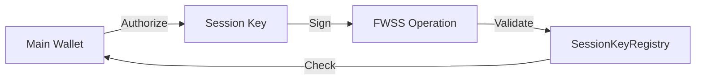
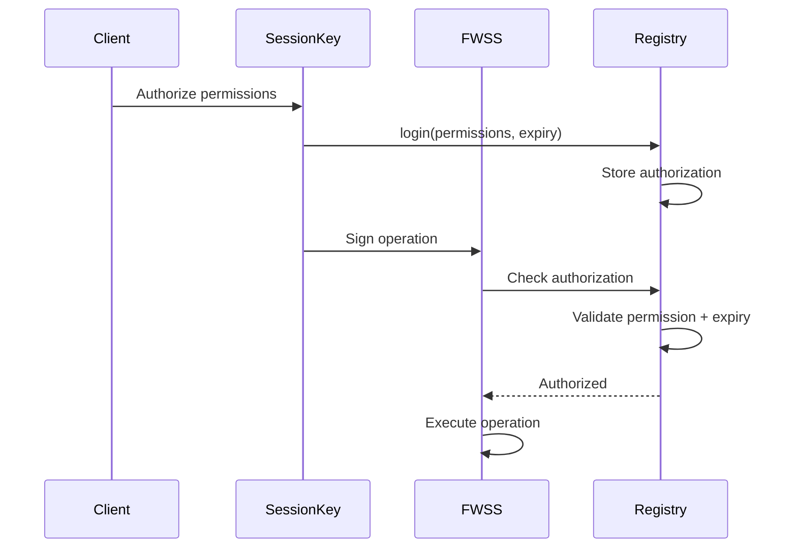

## Overview

The SessionKeyRegistry contract manages disposable keys that allow dapps to perform actions on a user's behalf. It provides:

- Scoped permissions (specific operations only)
- Expiration-based authorization
- Identity-based key management
- Permission hashing for validation

## Architecture



## Data Structures

### Authorization

```solidity
struct Authorization {
    address identity;           // Root wallet address
    address sessionKeyAddress;  // Delegated key
    bytes32[] permissions;      // Permission hashes
    uint256 expiry;            // Expiration timestamp
}
```

### Permission Hash

```solidity
// Permission = keccak256(abi.encodePacked(target, selector))
bytes32 permission = keccak256(
    abi.encodePacked(
        fwssAddress,           // Target contract
        bytes4(selector)       // Function selector
    )
);
```

## Permission Management

### Login (Authorize Session Key)

```typescript
import { login } from '@filoz/synapse-core/session-key'
import * as Permissions from '@filoz/synapse-core/session-key/permissions'
import { createWalletClient, http } from 'viem'
import { calibration } from '@filoz/synapse-core/chains'

const mainClient = createWalletClient({
  chain: calibration,
  transport: http(),
  account: mainAccount,
})

const expiry = BigInt(Math.floor(Date.now() / 1000) + 86400) // 1 day

const hash = await login(mainClient, {
  sessionKeyAddress: sessionKey.address,
  permissions: Permissions.FWSSAllPermissions,
  expiry,
})

await mainClient.waitForTransactionReceipt({ hash })
console.log('Session key authorized')
```

### Revoke Session Key

```typescript
import { revoke } from '@filoz/synapse-core/session-key'

const hash = await revoke(mainClient, {
  sessionKeyAddress: sessionKey.address,
})

await mainClient.waitForTransactionReceipt({ hash })
```

## Permission Types

### FWSS Permissions

```typescript
import * as Permissions from '@filoz/synapse-core/session-key/permissions'

// Individual permissions
const createDataSet = Permissions.FWSSCreateDataSetPermission
const addPieces = Permissions.FWSSAddPiecesPermission
const terminateDataSet = Permissions.FWSSTerminateDataSetPermission
const removePiece = Permissions.FWSSRemovePiecePermission

// All FWSS permissions
const allPermissions = Permissions.FWSSAllPermissions

// Authorize specific permissions
const hash = await login(mainClient, {
  sessionKeyAddress: sessionKey.address,
  permissions: [
    createDataSet,
    addPieces,
  ],
  expiry,
})
```

### Custom Permissions

```typescript
import { createPermission } from '@filoz/synapse-core/session-key/permissions'

// Create permission for custom contract/function
const customPermission = createPermission(
  customContractAddress,
  '0x12345678' // function selector
)

const hash = await login(mainClient, {
  sessionKeyAddress: sessionKey.address,
  permissions: [customPermission],
  expiry,
})
```

## Query Authorizations

### Get Expiration

```typescript
import { getExpiration } from '@filoz/synapse-core/session-key'
import { createPublicClient } from 'viem'

const client = createPublicClient({
  chain: calibration,
  transport: http(),
})

const expiry = await getExpiration(client, {
  address: mainAccount.address,
  sessionKeyAddress: sessionKey.address,
  permission: Permissions.FWSSCreateDataSetPermission,
})

const now = BigInt(Math.floor(Date.now() / 1000))
const isValid = expiry > now

console.log('Expires:', new Date(Number(expiry) * 1000))
console.log('Valid:', isValid)
```

### Get Multiple Expirations

```typescript
import { getExpirations } from '@filoz/synapse-core/session-key'

const expirations = await getExpirations(client, {
  address: mainAccount.address,
  sessionKeyAddress: sessionKey.address,
  permissions: Permissions.FWSSAllPermissions,
})

for (const [permission, expiry] of Object.entries(expirations)) {
  const isExpired = expiry < BigInt(Math.floor(Date.now() / 1000))
  console.log(`${permission}: ${isExpired ? 'expired' : 'valid'}`)
}
```

### Check Authorization

```typescript
import { isAuthorized } from '@filoz/synapse-core/session-key'

const authorized = await isAuthorized(client, {
  address: mainAccount.address,
  sessionKeyAddress: sessionKey.address,
  permission: Permissions.FWSSCreateDataSetPermission,
})

if (authorized) {
  console.log('Session key is authorized')
} else {
  console.log('Session key is not authorized or expired')
}
```

## Events

### AuthorizationsUpdated

```solidity
event AuthorizationsUpdated(
    address indexed identity,
    address indexed sessionKeyAddress,
    bytes32[] permissions,
    uint256 expiry
);
```

### AuthorizationsRevoked

```solidity
event AuthorizationsRevoked(
    address indexed identity,
    address indexed sessionKeyAddress
);
```

### Listen for Events

```typescript
import { watchContractEvent } from 'viem/actions'

const unwatch = watchContractEvent(client, {
  address: calibration.contracts.sessionKeyRegistry.address,
  abi: calibration.contracts.sessionKeyRegistry.abi,
  eventName: 'AuthorizationsUpdated',
  args: {
    identity: mainAccount.address,
  },
  onLogs: (logs) => {
    for (const log of logs) {
      console.log('Authorization updated:')
      console.log('  Session key:', log.args.sessionKeyAddress)
      console.log('  Permissions:', log.args.permissions.length)
      console.log('  Expires:', new Date(Number(log.args.expiry) * 1000))
    }
  },
})
```

## Integration with Synapse

### Create Session Key

```typescript
import * as SessionKey from '@filoz/synapse-core/session-key'
import { generatePrivateKey } from 'viem/accounts'

// Generate new session key
const sessionPrivateKey = generatePrivateKey()

const sessionKey = SessionKey.fromSecp256k1({
  privateKey: sessionPrivateKey,
  root: mainAccount.address,
  chain: calibration,
})

console.log('Session key:', sessionKey.address)
console.log('Root:', sessionKey.rootAddress)
```

### Use with Synapse

```typescript
import { Synapse } from '@filoz/synapse-sdk'

const synapse = new Synapse({
  client: mainClient,
  sessionClient: sessionKey.client,
})

// All operations now use session key for signing
const result = await synapse.storage.upload(data)
```

## Permission Validation Flow



## Security

### Expiration Checks

Contract always validates expiration:

```solidity
require(
    block.timestamp <= authorizations[identity][sessionKey].expiry,
    "Session key expired"
);
```

### Permission Hashing

Permissions are hashed for gas efficiency:

```solidity
bytes32 permissionHash = keccak256(
    abi.encodePacked(targetContract, functionSelector)
);

require(
    hasPermission[permissionHash],
    "Permission not granted"
);
```

### Identity-Based

Authorizations are scoped to identity (root wallet):

```solidity
mapping(address => mapping(address => Authorization)) public authorizations;
// identity => sessionKey => authorization
```

## Best Practices

<CardGroup cols={2}>
  <Card title="Short Expiration" icon="clock">
    Use short expiration times (hours/days)
  </Card>
  <Card title="Minimal Permissions" icon="shield-halved">
    Grant only needed permissions
  </Card>
  <Card title="Revoke When Done" icon="ban">
    Revoke session keys after use
  </Card>
  <Card title="Monitor Expirations" icon="calendar-check">
    Track expiration and re-authorize as needed
  </Card>
</CardGroup>

## Error Handling

```typescript
try {
  await synapse.storage.upload(data)
} catch (error) {
  if (error.message.includes('Session key expired')) {
    // Re-authorize session key
    const expiry = BigInt(Math.floor(Date.now() / 1000) + 86400)
    await login(mainClient, {
      sessionKeyAddress: sessionKey.address,
      permissions: Permissions.FWSSAllPermissions,
      expiry,
    })
    await sessionKey.syncExpirations()
    
    // Retry operation
    await synapse.storage.upload(data)
  }
}
```

## Source Code

<Card title="Session Key Registry" href="https://github.com/FilOzone/SessionKeyRegistry" icon="github">
  View the SessionKeyRegistry contract source
</Card>

## Next Steps

<CardGroup cols={2}>
  <Card title="Session Keys Guide" href="/guides/session-keys" icon="key">
    Use session keys in your app
  </Card>
  <Card title="FWSS Contract" href="/contracts/warm-storage" icon="hard-drive">
    Learn how FWSS validates session keys
  </Card>
</CardGroup>