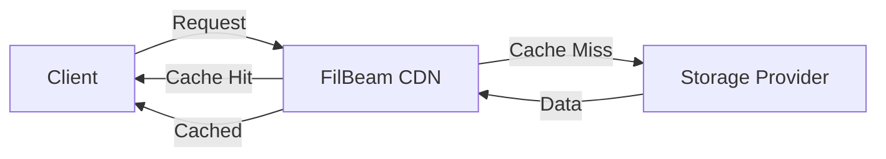

## Overview

FilBeam provides a pay-per-byte CDN layer on top of Filecoin storage, offering:

- Fast data retrieval through global CDN nodes
- Cache-based delivery for frequently accessed content
- Usage-based billing (only pay for data egress)
- Trusted measurement layer for accurate billing

## How It Works



<Note>
  FilBeam charges are usage-based:
  - **CDN Egress**: Data served from cache (fast)
  - **Cache Miss Egress**: Data retrieved from providers (triggers caching)
</Note>

## Enable CDN

<Steps>

### Upload with CDN

```typescript
import { Synapse } from '@filoz/synapse-sdk'

const synapse = await Synapse.create({ privateKey, rpcUrl })

// Enable CDN during upload
const result = await synapse.storage.upload(data, {
  withCDN: true,
})

console.log(`Uploaded with CDN enabled: ${result.pieceCid}`)
```

### Download with CDN

```typescript
// Download uses CDN automatically if enabled during upload
const data = await synapse.storage.download({ 
  pieceCid: result.pieceCid 
})

// Force CDN usage
const data = await synapse.storage.download({
  pieceCid: result.pieceCid,
  withCDN: true,
})
```

### Create Context with CDN

```typescript
const context = await synapse.storage.createContext({
  withCDN: true,
})

const result = await context.upload(data)
```

</Steps>

## Monitor Usage

### Check Data Set Quotas

```typescript
const stats = await synapse.filbeam.getDataSetStats('12345')

console.log('Remaining quotas:')
console.log(`  CDN Egress: ${stats.cdnEgressQuota} bytes`)
console.log(`  Cache Miss: ${stats.cacheMissEgressQuota} bytes`)
```

### Calculate Remaining Bandwidth

```typescript
function formatBytes(bytes) {
  const gb = Number(bytes) / (1024 ** 3)
  return `${gb.toFixed(2)} GB`
}

const stats = await synapse.filbeam.getDataSetStats('12345')

console.log('Available bandwidth:')
console.log(`  Fast (cached): ${formatBytes(stats.cdnEgressQuota)}`)
console.log(`  Slow (uncached): ${formatBytes(stats.cacheMissEgressQuota)}`)
```

## Pricing

### Get CDN Pricing

```typescript
const info = await synapse.storage.getStorageInfo()

console.log('Storage pricing:')
console.log(`  Base storage: ${info.pricing.noCDN.perTiBPerMonth}`)
console.log(`  Token: ${info.pricing.tokenSymbol}`)

// Note: CDN costs are usage-based (egress charges)
// Base storage price is the same with or without CDN
```

### CDN Cost Structure

<Note>
  CDN pricing has two components:
  - **Base Storage**: Same as non-CDN (monthly rate per TiB)
  - **Egress Charges**: Pay per byte retrieved
    - CDN Egress: Data served from cache (cache hits)
    - Cache Miss Egress: Data pulled from providers (cache misses)
</Note>

## Preflight with CDN

Estimate costs including CDN:

```typescript
const preflight = await synapse.storage.preflightUpload({ 
  size: 1024 * 1024 * 100, // 100 MB
  withCDN: true,
})

console.log('Estimated base storage costs:')
console.log(`  Per epoch: ${preflight.estimatedCost.perEpoch}`)
console.log(`  Per day: ${preflight.estimatedCost.perDay}`)
console.log(`  Per month: ${preflight.estimatedCost.perMonth}`)

console.log('\nNote: Egress charges are usage-based')
```

## Metadata Integration

CDN status is stored in metadata:

```typescript
// CDN is indicated by metadata key
const result = await synapse.storage.upload(data, {
  withCDN: true,
  metadata: {
    category: 'videos',
    // 'withCDN' key is added automatically
  },
})
```

## FilBeam Service

Direct FilBeam service access:

```typescript
import { FilBeamService } from '@filoz/synapse-sdk'
import { calibration } from '@filoz/synapse-core/chains'

// Create service
const filbeam = new FilBeamService(calibration)

// Get stats
const stats = await filbeam.getDataSetStats('12345')

// Stats are BigInt for precision
console.log(typeof stats.cdnEgressQuota) // 'bigint'
```

## CDN URLs

Retrieve data via FilBeam URLs:

```typescript
import * as Piece from '@filoz/synapse-core/piece'

// Create FilBeam URL
const url = Piece.createFilBeamUrl({
  cid: pieceCid.toString(),
  chain: 'calibration',
})

console.log(`FilBeam URL: ${url}`)
// https://calibration.filbeam.com/piece/{pieceCid}
```

## Network-Specific Endpoints

```typescript
import { mainnet, calibration } from '@filoz/synapse-core/chains'

// Mainnet FilBeam
const mainnetService = new FilBeamService(mainnet)
const mainnetStats = await mainnetService.getDataSetStats('12345')
// Uses: https://stats.filbeam.com

// Calibration testnet
const testnetService = new FilBeamService(calibration)
const testnetStats = await testnetService.getDataSetStats('12345')
// Uses: https://calibration.stats.filbeam.com
```

## Error Handling

```typescript
try {
  const stats = await synapse.filbeam.getDataSetStats('12345')
} catch (error) {
  if (error.message.includes('Data set not found')) {
    console.error('Data set does not exist')
  } else if (error.message.includes('HTTP 404')) {
    console.error('Data set not available on FilBeam')
  } else {
    console.error('FilBeam error:', error.message)
  }
}
```

## Use Cases

<CardGroup cols={2}>
  <Card title="Video Streaming" icon="video">
    Serve videos with low latency to global audiences
  </Card>
  <Card title="Large Files" icon="file-arrow-down">
    Fast downloads for frequently accessed files
  </Card>
  <Card title="Public Content" icon="globe">
    Distribute public datasets efficiently
  </Card>
  <Card title="Hot Storage" icon="fire">
    Cache frequently accessed data for performance
  </Card>
</CardGroup>

## Best Practices

<Steps>

### Choose CDN for Hot Data

Enable CDN for frequently accessed content:

```typescript
// Public content that's accessed often
const result = await synapse.storage.upload(publicVideo, {
  withCDN: true,
  pieceMetadata: {
    category: 'public-content',
    access: 'frequent',
  },
})
```

### Monitor Quotas

Regularly check remaining quotas:

```typescript
setInterval(async () => {
  const stats = await synapse.filbeam.getDataSetStats('12345')
  
  if (stats.cdnEgressQuota < 1_000_000_000n) {
    console.warn('Low CDN quota remaining')
    // Add more credits or notify admin
  }
}, 3600000) // Check hourly
```

### Cost Optimization

Use CDN selectively:

```typescript
// Hot data: use CDN
await synapse.storage.upload(hotData, { withCDN: true })

// Cold data: skip CDN
await synapse.storage.upload(archiveData, { withCDN: false })
```

</Steps>

## Limitations

<Warning>
  - CDN availability depends on data set configuration
  - First request may have cache-miss latency
  - Quotas must be monitored and replenished
  - Not available on devnet/local networks
</Warning>

## Next Steps

<CardGroup cols={2}>
  <Card title="Storage Operations" href="/guides/storage-operations" icon="hard-drive">
    Learn about upload and download operations
  </Card>
  <Card title="Payment Management" href="/guides/payment-management" icon="credit-card">
    Manage payments for CDN usage
  </Card>
</CardGroup>