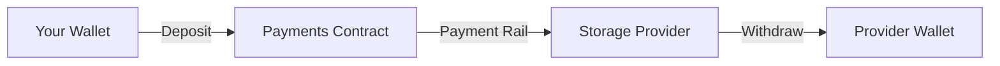

## Overview

The Synapse SDK integrates with Filecoin Pay to handle all payment operations. This guide covers deposits, withdrawals, operator approvals, and payment rail management.

## Payment Architecture

Filecoin Pay uses **payment rails** - automated payment channels between payers and payees that support continuous rate-based payments.



## Quick Start

<Steps>

### Check Balance

```typescript
import { Synapse } from '@filoz/synapse-sdk'

const synapse = await Synapse.create({ privateKey, rpcUrl })

// Check wallet balance (USDFC)
const walletBalance = await synapse.payments.walletBalance('USDFC')
console.log(`Wallet: ${walletBalance} (base units)`)

// Check payments contract balance
const contractBalance = await synapse.payments.balance()
console.log(`Contract: ${contractBalance} (base units)`)
```

### Deposit Funds

```typescript
import { parseUnits } from '@filoz/synapse-sdk'

// Deposit 100 USDFC
const hash = await synapse.payments.deposit({
  amount: parseUnits('100'),
  onAllowanceCheck: (current, required) => {
    console.log(`Current allowance: ${current}`)
  },
  onApprovalTransaction: (tx) => {
    console.log(`Approval tx: ${tx}`)
  },
  onDepositStarting: () => {
    console.log('Starting deposit...')
  },
})

await synapse.client.waitForTransactionReceipt({ hash })
console.log('Deposit complete')
```

### Withdraw Funds

```typescript
// Withdraw 50 USDFC
const hash = await synapse.payments.withdraw({
  amount: parseUnits('50'),
})

await synapse.client.waitForTransactionReceipt({ hash })
```

</Steps>

## Operator Approvals

Approve service contracts (like Warm Storage) to create payment rails on your behalf:

```typescript
// Approve Warm Storage service
const hash = await synapse.payments.approveService({
  rateAllowance: parseUnits('10'), // Max 10 USDFC per epoch
  lockupAllowance: parseUnits('1000'), // Max 1000 USDFC lockup
  maxLockupPeriod: 2880n, // Max 30 days in epochs
})

await synapse.client.waitForTransactionReceipt({ hash })
```

### Check Approval Status

```typescript
const approval = await synapse.payments.serviceApproval()

console.log('Approved:', approval.isApproved)
console.log('Rate allowance:', approval.rateAllowance)
console.log('Lockup allowance:', approval.lockupAllowance)
console.log('Rate used:', approval.rateUsage)
console.log('Lockup used:', approval.lockupUsage)
```

### Revoke Approval

```typescript
const hash = await synapse.payments.revokeService()
await synapse.client.waitForTransactionReceipt({ hash })
```

## Payment Rails

### Query Active Rails

```typescript
// Get rails where you're the payer
const payerRails = await synapse.payments.getRailsAsPayer()

for (const rail of payerRails) {
  console.log(`Rail ${rail.railId}:`)
  console.log(`  Payee: ${rail.payee}`)
  console.log(`  Rate: ${rail.rate} per epoch`)
  console.log(`  Status: ${rail.active ? 'Active' : 'Terminated'}`)
}

// Get rails where you're the payee
const payeeRails = await synapse.payments.getRailsAsPayee()
```

### Get Rail Details

```typescript
const rail = await synapse.payments.getRail({ railId: 42n })

console.log('Client:', rail.client)
console.log('Payee:', rail.payee)
console.log('Operator:', rail.operator)
console.log('Rate per epoch:', rail.rate)
console.log('Start epoch:', rail.startEpoch)
console.log('Last settled:', rail.lastSettledEpoch)
console.log('End epoch:', rail.endEpoch)
```

## Settlement

### Estimate Settlement

Get settlement amounts without executing:

```typescript
const settlement = await synapse.payments.getSettlementAmounts({ 
  railId: 42n 
})

console.log('Total settled:', settlement.totalSettledAmount)
console.log('Net payee:', settlement.totalNetPayeeAmount)
console.log('Operator fee:', settlement.totalOperatorCommission)
console.log('Network fee:', settlement.totalNetworkFee)
console.log('Final epoch:', settlement.finalSettledEpoch)
```

### Settle a Rail

```typescript
// Settle up to current epoch
const hash = await synapse.payments.settle({ railId: 42n })

// Settle to specific epoch
const hash = await synapse.payments.settle({ 
  railId: 42n,
  untilEpoch: 1000n,
})

await synapse.client.waitForTransactionReceipt({ hash })
```

### Auto-Settle

Automatically detect and settle (handles both active and terminated rails):

```typescript
const hash = await synapse.payments.settleAuto({ railId: 42n })
await synapse.client.waitForTransactionReceipt({ hash })
```

### Emergency Settlement

For terminated rails only (bypasses validation):

```typescript
const hash = await synapse.payments.settleTerminatedRail({ railId: 42n })
await synapse.client.waitForTransactionReceipt({ hash })
```

## Advanced Deposits

### Deposit with Permit

Use ERC-2612 permit for gasless approval:

```typescript
const hash = await synapse.payments.depositWithPermit({
  amount: parseUnits('100'),
  deadline: BigInt(Math.floor(Date.now() / 1000) + 3600), // 1 hour
})
```

### Deposit and Approve Operator

Combine deposit and operator approval in one transaction:

```typescript
const hash = await synapse.payments.depositWithPermitAndApproveOperator({
  amount: parseUnits('100'),
  rateAllowance: parseUnits('10'),
  lockupAllowance: parseUnits('1000'),
})

await synapse.client.waitForTransactionReceipt({ hash })
```

## Token Allowances

### Check Allowance

```typescript
const chain = synapse.client.chain
const allowance = await synapse.payments.allowance({
  spender: chain.contracts.filecoinPay.address,
})

console.log(`Allowance: ${allowance}`)
```

### Approve Token Spending

```typescript
const hash = await synapse.payments.approve({
  spender: chain.contracts.filecoinPay.address,
  amount: parseUnits('1000'),
})

await synapse.client.waitForTransactionReceipt({ hash })
```

## Account Information

```typescript
const accountInfo = await synapse.payments.accountInfo()

console.log('Available funds:', accountInfo.availableFunds)
console.log('Total deposited:', accountInfo.totalDeposited)
console.log('Total withdrawn:', accountInfo.totalWithdrawn)
console.log('Total paid:', accountInfo.totalPaid)
console.log('Total received:', accountInfo.totalReceived)
```

## Formatting Utilities

```typescript
import { formatUnits, parseUnits } from '@filoz/synapse-sdk'

// Convert to human-readable
const balance = await synapse.payments.balance()
console.log(`Balance: ${formatUnits(balance)} USDFC`)

// Convert from human-readable
const amount = parseUnits('100.5') // 100.5 USDFC
```

## Best Practices

<CardGroup cols={2}>
  <Card title="Monitor Balance" icon="gauge-high">
    Regularly check payments contract balance to avoid service interruption
  </Card>
  <Card title="Set Allowances" icon="shield-check">
    Configure appropriate rate and lockup allowances for operators
  </Card>
  <Card title="Settle Regularly" icon="calendar-check">
    Settle rails periodically to free up funds
  </Card>
  <Card title="Use Permits" icon="stamp">
    Use permit functions to reduce transaction count
  </Card>
</CardGroup>

## Error Handling

```typescript
try {
  await synapse.payments.deposit({ amount: parseUnits('100') })
} catch (error) {
  if (error.message.includes('Insufficient USDFC')) {
    console.error('Not enough USDFC in wallet')
  } else if (error.message.includes('allowance')) {
    console.error('Need to approve token spending')
  }
}
```

## Next Steps

<CardGroup cols={2}>
  <Card title="Storage Operations" href="/guides/storage-operations" icon="hard-drive">
    Learn how to use storage with your payment setup
  </Card>
  <Card title="FileCoin Pay Contract" href="/contracts/filecoin-pay" icon="file-contract">
    Deep dive into the payment rails contract
  </Card>
</CardGroup>