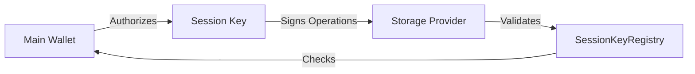

## Overview

Session keys are disposable keys that allow dapps to perform actions on a user's behalf without exposing the main wallet. They provide:

- Delegated signing for storage operations
- Scoped permissions with expiration
- Reduced wallet prompts for better UX
- Security through limited authorization

## Architecture



## Quick Start

<Steps>

### Create a Session Key

```typescript
import * as SessionKey from '@filoz/synapse-core/session-key'
import { Synapse } from '@filoz/synapse-sdk'
import { generatePrivateKey } from 'viem/accounts'
import { calibration } from '@filoz/synapse-core/chains'

// Generate new session key
const sessionPrivateKey = generatePrivateKey()

// Create session key account
const sessionKey = SessionKey.fromSecp256k1({
  privateKey: sessionPrivateKey,
  root: mainAccount.address,
  chain: calibration,
})

console.log('Session key address:', sessionKey.address)
console.log('Root address:', sessionKey.rootAddress)
```

### Authorize Permissions

```typescript
import { login } from '@filoz/synapse-core/session-key'
import * as Permissions from '@filoz/synapse-core/session-key/permissions'

// Define permissions and expiration (30 days)
const expiry = BigInt(Math.floor(Date.now() / 1000) + 30 * 24 * 3600)

const hash = await login(mainClient, {
  sessionKeyAddress: sessionKey.address,
  permissions: Permissions.FWSSAllPermissions,
  expiry,
})

await mainClient.waitForTransactionReceipt({ hash })
console.log('Session key authorized')
```

### Use Session Key with Synapse

```typescript
const synapse = new Synapse({
  client: mainClient,
  sessionClient: sessionKey.client,
})

// All operations now use session key for signing
const result = await synapse.storage.upload(data)
console.log('Uploaded using session key')
```

</Steps>

## Permissions

### FWSS Permissions

Filecoin Warm Storage Service has several permission types:

```typescript
import * as Permissions from '@filoz/synapse-core/session-key/permissions'

// Individual permissions
const createDataSetPerm = Permissions.FWSSCreateDataSetPermission
const addPiecesPerm = Permissions.FWSSAddPiecesPermission
const terminatePerm = Permissions.FWSSTerminateDataSetPermission
const removePiecePerm = Permissions.FWSSRemovePiecePermission

// All permissions (recommended)
const allPerms = Permissions.FWSSAllPermissions
```

### Grant Specific Permissions

```typescript
import { login } from '@filoz/synapse-core/session-key'

// Only allow creating datasets and adding pieces
const hash = await login(mainClient, {
  sessionKeyAddress: sessionKey.address,
  permissions: [
    Permissions.FWSSCreateDataSetPermission,
    Permissions.FWSSAddPiecesPermission,
  ],
  expiry: BigInt(Math.floor(Date.now() / 1000) + 86400), // 1 day
})
```

## Check Permissions

```typescript
// Check single permission
if (sessionKey.hasPermission(Permissions.FWSSCreateDataSetPermission)) {
  console.log('Can create datasets')
}

// Check multiple permissions
if (sessionKey.hasPermissions(Permissions.FWSSAllPermissions)) {
  console.log('Has all FWSS permissions')
}

// Get all expirations
const expirations = sessionKey.expirations
for (const [permission, expiry] of Object.entries(expirations)) {
  console.log(`${permission}: expires at ${new Date(Number(expiry) * 1000)}`)
}
```

## Sync Permissions

Sync permissions from the blockchain:

```typescript
// Sync all permissions
await sessionKey.syncExpirations()

// Sync specific permissions
await sessionKey.syncExpirations([
  Permissions.FWSSCreateDataSetPermission,
  Permissions.FWSSAddPiecesPermission,
])
```

## Watch for Changes

Listen for permission updates:

```typescript
// Start watching
const unwatch = await sessionKey.watch()

// Listen for updates
sessionKey.addEventListener('expirationsUpdated', (event) => {
  console.log('Permissions updated:', event.detail)
})

sessionKey.addEventListener('connected', (event) => {
  console.log('Watching started:', event.detail)
})

sessionKey.addEventListener('disconnected', () => {
  console.log('Watching stopped')
})

sessionKey.addEventListener('error', (event) => {
  console.error('Watch error:', event.detail)
})

// Stop watching
unwatch()
// or
sessionKey.unwatch()
```

## Revoke Session Key

```typescript
import { revoke } from '@filoz/synapse-core/session-key'

const hash = await revoke(mainClient, {
  sessionKeyAddress: sessionKey.address,
})

await mainClient.waitForTransactionReceipt({ hash })
console.log('Session key revoked')
```

## Query Authorizations

```typescript
import { getExpirations } from '@filoz/synapse-core/session-key'

const expirations = await getExpirations(client, {
  address: mainAccount.address,
  sessionKeyAddress: sessionKey.address,
  permissions: Permissions.FWSSAllPermissions,
})

for (const [permission, expiry] of Object.entries(expirations)) {
  const isExpired = expiry < BigInt(Math.floor(Date.now() / 1000))
  console.log(`${permission}: ${isExpired ? 'expired' : 'valid'}`)
}
```

## Storage Operations

Session keys work seamlessly with storage:

```typescript
const synapse = new Synapse({
  client: mainClient,
  sessionClient: sessionKey.client,
})

// Upload (uses session key for signing)
const result = await synapse.storage.upload(data, {
  callbacks: {
    onStored: (providerId, pieceCid) => {
      console.log('Stored with session key')
    },
  },
})

// Download (session key not needed for reads)
const downloaded = await synapse.storage.download({ 
  pieceCid: result.pieceCid 
})
```

## Split Operations

Session keys with split operations:

```typescript
const [primary, secondary] = await synapse.storage.createContexts({
  count: 2,
})

// Store (session key signs)
const stored = await primary.store(data)

// Pre-sign for commit (session key signs)
const extraData = await secondary.presignForCommit([
  { pieceCid: stored.pieceCid },
])

// Pull (session key auth in extraData)
await secondary.pull({
  pieces: [stored.pieceCid],
  from: (cid) => primary.getPieceUrl(cid),
  extraData,
})

// Commit (session key signs via extraData)
await primary.commit({ pieces: [{ pieceCid: stored.pieceCid }] })
await secondary.commit({ 
  pieces: [{ pieceCid: stored.pieceCid }],
  extraData,
})
```

## Security Best Practices

<CardGroup cols={2}>
  <Card title="Short Expiration" icon="clock">
    Use short expiration times (hours or days, not months)
  </Card>
  <Card title="Minimal Permissions" icon="shield-halved">
    Grant only the permissions needed for the task
  </Card>
  <Card title="Secure Storage" icon="lock">
    Store session keys securely (never commit to git)
  </Card>
  <Card title="Revoke When Done" icon="ban">
    Revoke session keys when no longer needed
  </Card>
</CardGroup>

## Expiration Management

```typescript
// Check if expired
const now = BigInt(Math.floor(Date.now() / 1000))
const createExpiry = sessionKey.expirations[Permissions.FWSSCreateDataSetPermission]

if (createExpiry < now) {
  console.log('Permission expired, need to re-authorize')
  
  // Re-authorize
  const hash = await login(mainClient, {
    sessionKeyAddress: sessionKey.address,
    permissions: Permissions.FWSSAllPermissions,
    expiry: now + 86400n, // 1 day
  })
  
  await mainClient.waitForTransactionReceipt({ hash })
  await sessionKey.syncExpirations()
}
```

## Session Key Account

Create session key account without full session key:

```typescript
import { accountFromSecp256k1 } from '@filoz/synapse-core/session-key'
import type { Hex } from 'viem'

const account = accountFromSecp256k1({
  privateKey: '0x...' as Hex,
  rootAddress: mainAccount.address,
})

console.log('Account type:', account.source) // 'sessionKey'
console.log('Key type:', account.keyType) // 'Secp256k1'
console.log('Root:', account.rootAddress)
```

## Error Handling

```typescript
try {
  await synapse.storage.upload(data)
} catch (error) {
  if (error.message.includes('SessionKeyNotAuthorized')) {
    console.error('Session key not authorized or expired')
    // Re-authorize session key
  } else if (error.message.includes('InvalidSignature')) {
    console.error('Session key signature invalid')
  }
}
```

## Browser Usage

```typescript
// Store session key in sessionStorage (cleared on tab close)
const sessionPrivateKey = generatePrivateKey()
sessionStorage.setItem('sessionKey', sessionPrivateKey)

// Retrieve session key
const storedKey = sessionStorage.getItem('sessionKey') as Hex
const sessionKey = SessionKey.fromSecp256k1({
  privateKey: storedKey,
  root: mainAccount.address,
  chain: calibration,
})
```

<Warning>
  Never store session keys in localStorage - use sessionStorage or secure key management.
</Warning>

## Complete Example

```typescript
import { Synapse } from '@filoz/synapse-sdk'
import * as SessionKey from '@filoz/synapse-core/session-key'
import { login } from '@filoz/synapse-core/session-key'
import * as Permissions from '@filoz/synapse-core/session-key/permissions'
import { generatePrivateKey } from 'viem/accounts'
import { calibration } from '@filoz/synapse-core/chains'

// 1. Create main client
const mainClient = createWalletClient({
  chain: calibration,
  transport: http(),
  account: privateKeyToAccount('0x...'),
})

// 2. Generate session key
const sessionPrivateKey = generatePrivateKey()
const sessionKey = SessionKey.fromSecp256k1({
  privateKey: sessionPrivateKey,
  root: mainClient.account,
  chain: calibration,
})

// 3. Authorize session key
const expiry = BigInt(Math.floor(Date.now() / 1000) + 86400) // 1 day
const hash = await login(mainClient, {
  sessionKeyAddress: sessionKey.address,
  permissions: Permissions.FWSSAllPermissions,
  expiry,
})
await mainClient.waitForTransactionReceipt({ hash })

// 4. Create Synapse with session key
const synapse = new Synapse({
  client: mainClient,
  sessionClient: sessionKey.client,
})

// 5. Use storage operations
const result = await synapse.storage.upload(data)
console.log('Uploaded with session key:', result.pieceCid)

// 6. Revoke when done
await revoke(mainClient, {
  sessionKeyAddress: sessionKey.address,
})
```

## Next Steps

<CardGroup cols={2}>
  <Card title="Storage Operations" href="/guides/storage-operations" icon="hard-drive">
    Use session keys with storage operations
  </Card>
  <Card title="Session Key Registry" href="/contracts/session-key-registry" icon="file-contract">
    Learn about the registry contract
  </Card>
</CardGroup>