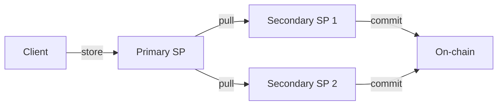

## Overview

Synapse SDK provides comprehensive storage operations for Filecoin Onchain Cloud. This guide covers uploading files, downloading data, and managing storage contexts.

## Upload Flow

The SDK uses a store → pull → commit pipeline for multi-copy durability:



<Steps>

### Initialize Synapse

```typescript
import { Synapse } from '@filoz/synapse-sdk'
import { http } from 'viem'
import { privateKeyToAccount } from 'viem/accounts'
import { calibration } from '@filoz/synapse-core/chains'

const account = privateKeyToAccount('0x...')
const synapse = Synapse.create({
  chain: calibration,
  transport: http(),
  account,
})
```

### Upload a File

For single files, use the simple upload method:

```typescript
import fs from 'fs'
import { Readable } from 'stream'

const fileStream = Readable.toWeb(fs.createReadStream('photo.jpg'))

const result = await synapse.storage.upload(fileStream, {
  callbacks: {
    onProviderSelected: (provider) => {
      console.log(`Selected SP ${provider.id}`)
    },
    onProgress: (bytesUploaded) => {
      console.log(`Uploaded: ${bytesUploaded} bytes`)
    },
    onStored: (providerId, pieceCid) => {
      console.log(`Stored on SP ${providerId}: ${pieceCid}`)
    },
    onPiecesConfirmed: (dataSetId, providerId, pieces) => {
      console.log(`Confirmed on SP ${providerId}`)
    },
  },
})

console.log(`PieceCID: ${result.pieceCid}`)
console.log(`Copies: ${result.copies.length}`)
```

### Download a File

```typescript
const data = await synapse.storage.download({ 
  pieceCid: result.pieceCid 
})

fs.writeFileSync('downloaded.jpg', data)
```

</Steps>

## Upload Options

### Multi-Copy Storage

By default, files are replicated to 2 providers for redundancy:

```typescript
const result = await synapse.storage.upload(data, {
  count: 3, // Upload to 3 providers
})

console.log(`Stored on ${result.copies.length} providers`)
```

### Specify Providers

Use specific storage providers:

```typescript
const result = await synapse.storage.upload(data, {
  providerIds: [1n, 2n, 3n],
})
```

### Enable CDN

Enable FilBeam CDN for faster retrieval:

```typescript
const result = await synapse.storage.upload(data, {
  withCDN: true,
})
```

## Preflight Checks

Check costs and allowances before uploading:

```typescript
const stat = await fs.promises.stat('largefile.mp4')

const preflight = await synapse.storage.preflightUpload({ 
  size: stat.size 
})

console.log('Estimated costs:')
console.log(`  Per epoch: ${preflight.estimatedCost.perEpoch}`)
console.log(`  Per day: ${preflight.estimatedCost.perDay}`)
console.log(`  Per month: ${preflight.estimatedCost.perMonth}`)

if (!preflight.allowanceCheck.sufficient) {
  console.error('Insufficient allowances:', preflight.allowanceCheck.message)
  // Set up allowances first
}
```

## Storage Context

For advanced control, use storage contexts:

```typescript
const context = await synapse.storage.createContext({
  withCDN: true,
  callbacks: {
    onProviderSelected: (provider) => {
      console.log(`Using provider: ${provider.serviceProvider}`)
    },
  },
})

// Upload using context
const result = await context.upload(data)
```

## Metadata

Attach metadata to uploads:

```typescript
const result = await synapse.storage.upload(data, {
  pieceMetadata: {
    name: 'vacation-photo.jpg',
    category: 'photos',
    owner: 'alice',
  },
})
```

<Note>
  - Maximum 5 metadata keys per piece
  - Keys: max 32 characters
  - Values: max 128 characters
</Note>

## Download Options

### Download from Specific Provider

```typescript
const data = await synapse.storage.download({
  pieceCid,
  providerAddress: '0x...',
})
```

### Download with CDN

```typescript
const data = await synapse.storage.download({
  pieceCid,
  withCDN: true, // Use FilBeam CDN
})
```

## Error Handling

```typescript
import { StoreError, CommitError } from '@filoz/synapse-sdk'

try {
  const result = await synapse.storage.upload(data)
} catch (error) {
  if (error instanceof StoreError) {
    console.error('Upload failed:', error.providerId)
  } else if (error instanceof CommitError) {
    console.error('Commit failed:', error.providerId)
  }
}
```

## Size Limits

```typescript
import { SIZE_CONSTANTS } from '@filoz/synapse-sdk'

console.log(`Min upload size: ${SIZE_CONSTANTS.MIN_UPLOAD_SIZE}`)
console.log(`Max upload size: ${SIZE_CONSTANTS.MAX_UPLOAD_SIZE}`)
```

<Note>
  Files exceeding the maximum size should be split into multiple uploads.
</Note>

## Best Practices

<CardGroup cols={2}>
  <Card title="Use Streaming" icon="water">
    Stream large files to minimize memory usage
  </Card>
  <Card title="Check Preflight" icon="plane-departure">
    Always run preflight checks for cost estimates
  </Card>
  <Card title="Multi-Copy" icon="copy">
    Use at least 2 copies for data redundancy
  </Card>
  <Card title="Handle Failures" icon="triangle-exclamation">
    Check result.failures for partial upload issues
  </Card>
</CardGroup>

## Next Steps

<CardGroup cols={2}>
  <Card title="Multi-Copy Storage" href="/examples/multi-copy-storage" icon="copy">
    Learn advanced multi-provider upload patterns
  </Card>
  <Card title="Split Operations" href="/examples/split-operations" icon="scissors">
    Use store/pull/commit for batch uploads
  </Card>
</CardGroup>